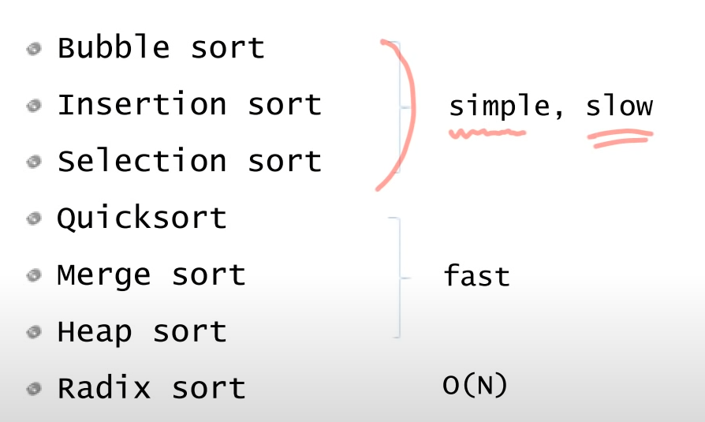

# Sort  

정렬은 매우 기본적이고 많은 영향을 끼치는 알고리즘이다.  

  

그림과 같이 간단하지만 느린, 조금 복잡하지만 성능의 측면에서 빠른  

- stable sort: 같은 값에 대해서 정렬 전후에 순서가 유지되는 정렬 알고리즘
  - 종류: 버블정렬, 삽입정렬, 합병정렬, 기수정렬
- unstable sort: 같은 값에 대해서 정렬 전후에 순서가 유지되지 않는 정렬 알고리즘
  - 종류: 선택정렬, 퀵정렬, 힙정렬

## Selection Sort  

선택정렬은 가장 간단한 알고리즘으로  

1. 가장 큰 값을 맨 마지막순서로 swap한다.  

위의 내용을 남아있는 데이터가 있을 때까지 반복한다.  

```cs
namespace Sort
{
    class SelectionSort : ISort
    {
        public int[] Sort(int[] arr, int n)
        {
            int[] p = arr;
            for (int last = n - 1; last >= 1; last--)
            {
                int maxIndex = last;
                for (int k = 0; k < last; k++)
                {
                    if (p[k] > p[maxIndex])
                    {
                        maxIndex = k;
                    }
                }

                Program.Swap(ref p[last], ref p[maxIndex]);
            }

            return p;
        }
    }
}
```

지금 코드는 큰 값부터 뒤로 계산하지만 작은 값부터 앞으로도 가능하다.  

반복이 2번 들어가기 때문에 n제곱만큼 복잡도를 가진다.  

## Bubble Sort  

악명높은 끔찍한 정렬 알고리즘 버블정렬이다.  

선택정렬은 한 인자당 한번의 스왑을 가진다면 버블은 한칸 씩 비교해가며 스왑하기 때문에 큰 값을 마지막 인덱스까지 교환한다.  

```cs
namespace Sort
{
    class BubbleSort : ISort
    {
        public int[] Sort(int[] arr, int n)
        {
            int[] p = arr;
            for (int last = n - 1; last >= 1; last--)
            {
                for (int i = 0; i < last; i++)
                {
                    if (p[i] > p[i + 1])
                    {
                        Program.Swap(ref p[i], ref p[i + 1]);
                    }
                }
            }

            return p;
        }
    }
}
```

## Insertion Sort  

삽입정렬의 핵심은 이미 정렬된 데이터를 계속 만들어가며 하나씩 맞는 위치에 삽입하는 정렬이다.  

```cs
namespace Sort
{
    class InsertionSort : ISort
    {
        public int[] Sort(int[] arr, int n)
        {
            int[] p = arr;

            for (int i = 1; i < n; i++)
            {
                int key = p[i];

                int j;
                for (j = i - 1; j >= 0; j--)
                {
                    if(key < p[j])
                    {
                        p[j + 1] = p[j];
                    }
                    else
                    {
                        break;
                    }
                }
                p[j + 1] = key;
            }

            return p;
        }
    }
}
```

앞의 배열은 이미 정렬되어 있다는 가정하에 key값을 들고 해당 값보다 작다면 한칸 씩 뒤로 밀어주고 맞는 자리가 발견되면 삽입한다.  

코드 처럼 키 값을 들고 있다면 배열이 한칸 남기 때문에 배열의 특성을 이용하면 좀 더 간결하게 해결이 가능하다.  

## 분할정복법  

> Divde And Conquer

* 분할: 해결하고자 하는 문제를 작은 크기의 동일한 문제들로 분할
* 정복: 각각의 작은 문제를 순환적으로 해결  
* 합병: 작은 문제의 해를 합하여(merge) 원래 문제에 대한 해를 구함  

이해가 안될 땐 디버깅하면서 과정을 보면 이해가 잘댐

## Marge Sort  

합병정렬 그리고 퀵정렬은 분할정복법을 먼저 알아야 한다.  

```cs
namespace Sort
{
    class MergeSort : ISort
    {
        public int[] Sort(int[] arr, int n) 
        {// 배열 복사
            int[] newArr = new int[arr.Length];
            arr.CopyTo(newArr, 0);

            MergeAndSort(newArr, 0, newArr.Length - 1);

            return newArr;
        }

        private void MergeAndSort(int[] a, int p, int r)
        {
            if (p < r)
            {
                int q = (p + r) / 2; // 절반으로 분활
                MergeAndSort(a, p, q); // 재귀 호출 결국 1개로 정렬된 리스트를 만듬
                MergeAndSort(a, q + 1, r);
                Merge(a, p, q, r);
            }
        }

        private void Merge(int[] data, int p, int q, int r) // 이미 정렬되어 있다고 가정하고 하나씩 교환하는 과정
        {
            int i = p;
            int j = q + 1;
            int k = p;

            int[] temp = new int[data.Length];
            while (i <= q && j <= r)
            {
                if (data[i] <= data[j])
                {
                    temp[k++] = data[i++];
                }
                else
                {
                    temp[k++] = data[j++];
                }
            }
            while (i <= q)
            {
                temp[k++] = data[i++];
            }
            while (j <= r)
            {
                temp[k++] = data[j++];
            }
            for (int o = p; o <= r; o++)
            {
                data[o] = temp[o];
            }
        }
    }
}
```

## QuickSort  

퀵정렬으로 합병정렬과 차이점은 피봇을 정하고 작은 것과 큰 것으로 분리하여 분활함  

따라서 merge과정이 필요없음

분활하는 `Partition`과정에서 문제를 세분화하면 결국 정렬이 되는.. 


```cs
namespace Sort
{
    class QuickSort : ISort
    {
        public int[] Sort(int[] arr, int n)
        {
            int[] newArr = new int[arr.Length];
            arr.CopyTo(newArr, 0);

            QuickSortLogic(newArr, 0, newArr.Length - 1);

            return newArr;
        }

        private void QuickSortLogic(int[] a, int p, int r)
        {
            if (p < r)
            {
                int q = Partition(a, p, r);
                QuickSortLogic(a, p, q - 1);
                QuickSortLogic(a, q + 1, r);
            }
        }

        private int Partition(int[] a, int p, int r)
        {
            // pivot
            int x = a[r];

            int i = p - 1;
            for (int j = p; j < r; j++)
            {
                if (a[j] <= x)
                {
                    i++;
                    Program.Swap(ref a[i], ref a[j]);
                }
            }
            Program.Swap(ref a[i + 1], ref a[r]);
            
            return i + 1;
        }
    }
}
```

## 좌표정렬 (STL 정렬 활용 예시)

- vector를 사용한 정렬

```cpp
#include <bits/stdc++.h>

using namespace std;

int main() {
    int n;
    cin >> n;
    int p1, p2;
    vector<pair<int, int>> s;

    for (int i = 0; i < n; i++)
    {
        cin >> p1 >> p2;
        s.push_back(make_pair(p1, p2));
    }

    sort(s.begin(), s.end());

    for(auto p : s)
    {
        cout << p.first << " " << p.second << '\n';
    }
}
```

기본적으로 정렬은 위와 같이 수행되지만, 추가적인 조건을 설정하기 위해선 bool을 반환하는 compare함수를 인자로 넣어주면 된다.

```cpp
#include <bits/stdc++.h>

using namespace std;

bool compare(pair<int, int> a, pair<int, int> b){
    if (a.second == b.second)
        return a.first < b.first;
    else
        return a.second < b.second;
}

int main()
{
    int n;
    int p1, p2;
    vector<pair<int, int>> v;

    cin >> n;
    for (int i = 0; i < n; i++)
    {
        cin >> p1 >> p2;
        v.push_back(make_pair(p1, p2));
    }

    sort(v.begin(), v.end(), compare);

    for (int i = 0; i < n; i++)
        cout << v[i].first << ' ' << v[i].second << '\n';
}
```

이처럼 정렬에 특수한 조건을 달 수 있디. 람다형식으로도 사용 가능.

```cpp
sort(v.begin(), v.end(), [](const pair<int, int>& a, const pair<int, int>& b) {
    if (a.second == b.second)
        return a.first < b.first;
    else
        return a.second < b.second;
});
```