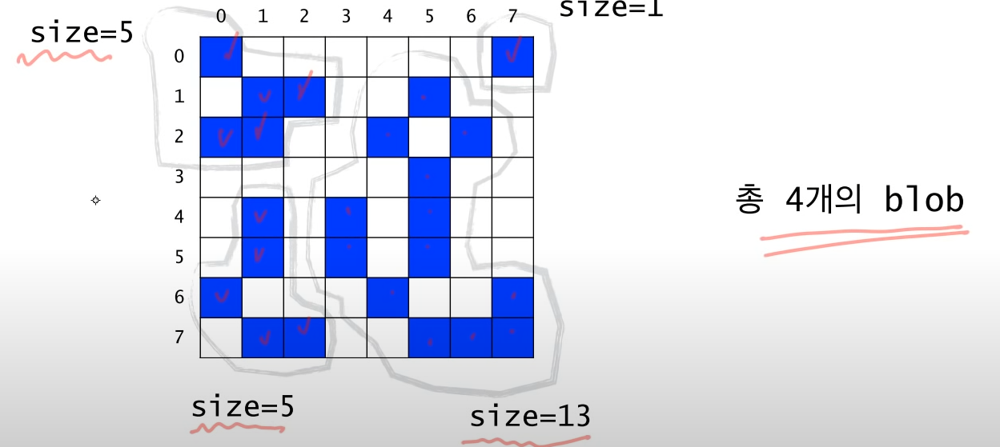
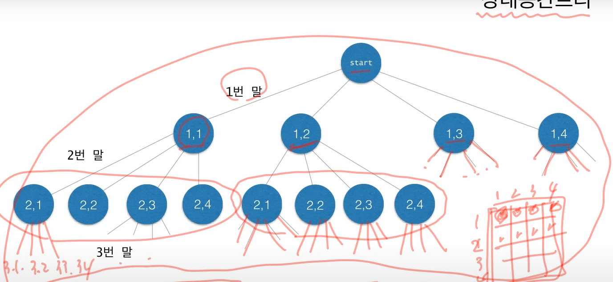

# Recursion  

재귀함수를 설계할 때 가장 중여한 점은 탈출이 가능한지에 대한 로직이다.  

자칫 무한루프에 빠질 수 있는 구조는 매우 위험하다.  

1. 탈출이 가능한 구조
2. 역순으로 구조를 생각  

## Maze.cs  

재귀함수를 활용한 미로탈출 알고리즘  

1. 현재 위치한 곳이 탈출 곳 이거나
2. 이웃한 셀이 탈출 곳 이거나  

이 두가지 경우를 재귀로 돌려서 검사함  

```cs
public static Boolean findMazePath(int x, int y)
{
    if (x < 0 || y < 0 || x >= N || y >= N) // 셀을 벗어나는 예외
    {
        return false;
    }
    else if (maze[y, x] != (int)TileType.PATHWAY_COLOR) // 갈 수 있는 곳인지 판단
    {
        return false;
    }
    else if (x == N-1 && y == N-1) // 탈출구 이거나
    {
        maze[y, x] = (int)TileType.PATH_COLOR;
        return true;
    }
    else // 이웃한 셀이 탈출구 이거나
    {
        maze[y, x] = (int)TileType.PATH_COLOR;
        if (findMazePath(x, y - 1) || findMazePath(x + 1, y) || findMazePath(x , y + 1) || findMazePath(x - 1, y))
        {
            return true;
        }

        maze[y, x] = (int)TileType.BLOCKED_COLOR;

        return false;
    }
}
```

## Counting_Cells_in_a_Blob.cs  

바이너리 이미지파일의 연속되는 blob을 검출함  



* 입력:

 N*N 크기의 2차원 그리드(grid)  
 하나의 좌표 (x, y)

* 출력:  

픽셀 (x, y)가 포함된 blob의 크기,
(x, y)가 어떤 blob에도 속하지 않는 경우에는 0  

*알고리즘, 프로젝트 설계의 경우 먼저 글로 써보고 다음에 수도코드(그림으로 그리던지 UML)순서로 가자*

* Recursive Thinking  

```
현재 픽셀이 속한 blob의 크기를 카운트 하려면  
    현재 픽셀이 image Color가 아니라면  
        0을 반환한다.
    현재 픽셀이 image Color라면  
        먼저 픽셀을 카운트 한다.
        현재 픽셀이 중복 카운트 되는 것을 방지하기 위해 다른 색으로 칠한다.  
        현재 픽셀에 이웃한 모든 픽셀에 대해서  
            그 픽셀이 속한 blob의 크기를 카운트하여 카운트에 더해준다.  
        카운트를 반환한다.  
```

* 수도 코드  

```
Algorithm for countCells(x, y)

if the pixel (x, y) is outside the grid
    the result is 0;
else if pixel (x, y) is not an image pixel or already counted
    the result is 0;
else
    set the colour of the pixel (x, y) to a red colour;
    the result is 1 plus the number of cells in each piece of
        the blob that includes a nearest neighbour;
```

```cs
public int CountCells(int x, int y)
{
    if (x < 0 || y < 0 || x >= _size || y >= _size)
    {
        return 0;
    }
    else if (cells[y, x] != (int)TileType.IMAGE)
    {
        return 0;
    }
    else
    {
        cells[y, x] = (int)TileType.ALREADY;
        return 1 + CountCells(x, y - 1) + CountCells(x + 1, y - 1)
            + CountCells(x + 1, y) + CountCells(x + 1, y + 1)
            + CountCells(x, y + 1) + CountCells(x - 1, y + 1)
            + CountCells(x - 1, y) + CountCells(x - 1, y - 1);
    }
}
```

## N-Queens  

재귀에서 하노이탑만큼 유명한 문제인 N-Queens문제이다.  

N * N체스판에 퀸의 이동가능한 거리에 N개의 퀸을 놓는 문제이다.  

BackTracking으로 푸는 문제.  

* 상태공간트리 : 찾는 해를 포함하는 트리  

즉, 해가 존재한다면 그것은 반드시 이 트리의 어떤 한 노드에 해당함  
따라서 이 트리를 체계적으로 탐색하면 해를 구할 수 있음  

  

backTracking은 상태공간트리의 모든 노드를 탐색할 필요가 없다.  

* return  

간단하게 bool로 참거짓을 반환  

* 인자  

level -> 현재 상태공간트리의 계층을 나타냄  

2차원 배열로 본다면 행을 의미  

전역변수로 지금 위치를 저장 cols[]  

일차원 배열로 체킹함  ex) 1, 3, 5...  

* 검증  

```cs
if (!Promising(level))
    return false;
```

함수 초반에 두어서 함수 콜 스택은 많아 지더라도 가독성이 올라감  

검사해야 하는 내용: 지금까지 저장된 cols에서만 검사하면 됨 즉, 현재 레벨을 인자로 넘겨주고 담겨있는 cols와 같은 열인지, 대각선인지 검사  

*같은 행은 검사할 필요가 없음 앞서 level을 넘겨줄 때 이미 재귀적으로 다음 열로 넘어가기 때문*  

```cs
private bool Promising(int level)
{
    for (int i = 1; i < level; i++) // 담겨있는 level까지만 검사
    {
        if (cols[i] == cols[level]) // 행 검사
        {
            return false;
        }
        else if (level - i == Math.Abs(cols[level] - cols[i])) // 대각선 검사
        {
            return false;
        }
    }

    return true;        
}
```

```cs
public bool queens(int level)
{
    if (!Promising(level))
        return false;
    else if (level == _size) // 탈출 조건
    {
        for (int i = 1; i < _size; i++)
        {
            System.Console.WriteLine($"{i}, {cols[i]} ");
        }
        return true;
    }
    for (int i = 1; i <= _size; i++) // 현재 사이즈만큼 즉 8인 정사각형의 경우 들어갈 수 있는 숫자 8까지 반복 검증
    {
        cols[level + 1] = i; // 다음 행에 값을 넣어주고 재귀 시작
        if (queens(level + 1)) // 재귀
        {
            return true;
        }
    }
    return false;
}
```

## Powerset  

멱집합이란 집합의 모든 부분집합을 의미한다.  

> {a, b, c, d, e, f}의 모든 부분집합을 나열하려면  
> a를 제외한 {b, c, d, e, f}의 모든 부분집합들을 나열하고
> {b, c, d, e, f}의 모든 부분집합에 {a}를 추가한 집합들을 나열한다.  

위를 재귀적으로 다룬다.  

