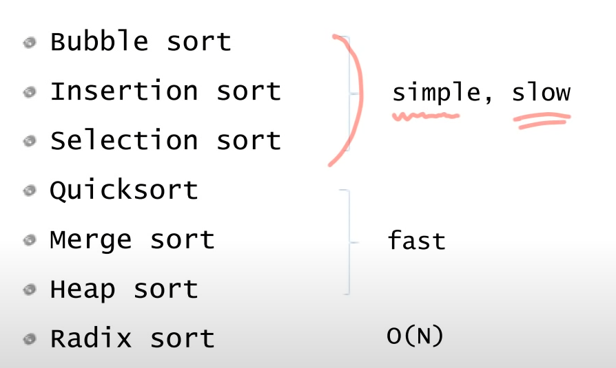

# Sort  

정렬은 매우 기본적이고 많은 영향을 끼치는 알고리즘이다.  

  

그림과 같이 간단하지만 느린, 조금 복잡하지만 성능의 측면에서 빠른  

## Selection Sort  

선택정렬은 가장 간단한 알고리즘으로  

1. 가장 큰 값을 맨 마지막순서로 swap한다.  

위의 내용을 남아있는 데이터가 있을 때까지 반복한다.  

```cs
namespace Sort
{
    class SelectionSort : ISort
    {
        public int[] Sort(int[] arr, int n)
        {
            int[] p = arr;
            for (int last = n - 1; last >= 1; last--)
            {
                int maxIndex = last;
                for (int k = 0; k < last; k++)
                {
                    if (p[k] > p[maxIndex])
                    {
                        maxIndex = k;
                    }
                }

                Program.Swap(ref p[last], ref p[maxIndex]);
            }

            return p;
        }
    }
}
```

지금 코드는 큰 값부터 뒤로 계산하지만 작은 값부터 앞으로도 가능하다.  

반복이 2번 들어가기 때문에 n제곱만큼 복잡도를 가진다.  

## Bubble Sort  

악명높은 끔찍한 정렬 알고리즘 버블정렬이다.  

선택정렬은 한 인자당 한번의 스왑을 가진다면 버블은 한칸 씩 비교해가며 스왑하기 때문에 큰 값을 마지막 인덱스까지 교환한다.  

```cs
namespace Sort
{
    class BubbleSort : ISort
    {
        public int[] Sort(int[] arr, int n)
        {
            int[] p = arr;
            for (int last = n - 1; last >= 1; last--)
            {
                for (int i = 0; i < last; i++)
                {
                    if (p[i] > p[i + 1])
                    {
                        Program.Swap(ref p[i], ref p[i + 1]);
                    }
                }
            }

            return p;
        }
    }
}
```

## Insertion Sort  

삽입정렬의 핵심은 이미 정렬된 데이터를 계속 만들어가며 하나씩 맞는 위치에 삽입하는 정렬이다.  

```cs
namespace Sort
{
    class InsertionSort : ISort
    {
        public int[] Sort(int[] arr, int n)
        {
            int[] p = arr;

            for (int i = 1; i < n; i++)
            {
                int key = p[i];

                int j;
                for (j = i - 1; j >= 0; j--)
                {
                    if(key < p[j])
                    {
                        p[j + 1] = p[j];
                    }
                    else
                    {
                        break;
                    }
                }
                p[j + 1] = key;
            }

            return p;
        }
    }
}
```

앞의 배열은 이미 정렬되어 있다는 가정하에 key값을 들고 해당 값보다 작다면 한칸 씩 뒤로 밀어주고 맞는 자리가 발견되면 삽입한다.  

코드 처럼 키 값을 들고 있다면 배열이 한칸 남기 때문에 배열의 특성을 이용하면 좀 더 간결하게 해결이 가능하다.